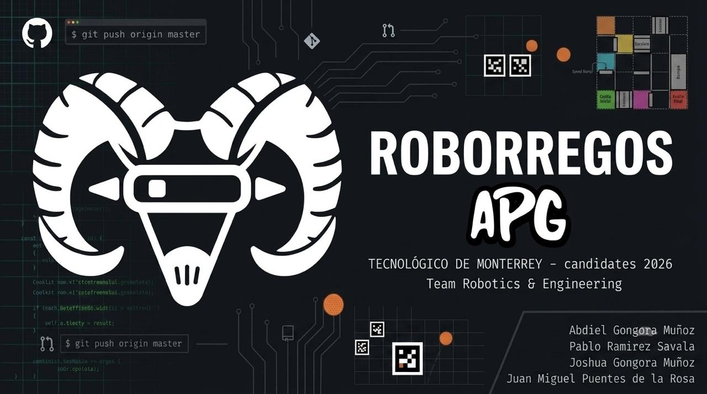

<div align="center">
  
</div>

<div align="center">
  <h1>APG Project</h1> 
  <p><b>RoBorregos Candidates 2026 | Tecnológico de Monterrey</b></p>
</div>

<br>

## 📌 About The Project

We are **APG**, a development and robotics team participating in the **Candidates 2026** competition organized by **RoBorregos** at Tecnológico de Monterrey. Our goal is to design, build, and program a fully autonomous robot capable of solving challenges in logic, navigation, image processing, and system control.

This repository contains the full documentation of our project:
* **Software:** Navigation algorithms, color detection, and computer vision.
* **Electronics:** Schematic designs, PCB development, and power management.
* **Mechanics:** 3D CAD models, assemblies, and structural analysis of the chassis and gripping systems.

<br>

## 🎯 The Challenge

The competition evaluates the performance of our autonomous robot across two main tracks:
* **Track A (MAZE):** Autonomous maze exploration and navigation using color sensors, obstacle traversal (ramps, stairs, and speed bumps), and ArUco marker detection via computer vision.
* **Track B (Levels):** Object manipulation (locating and transporting a ball), path-following with line avoidance, and real-time instruction execution based on colored floor tiles.

<br>

<div align="center">
  <h1>Team Members</h1> 
</div>

* Abdiel Gongora Muñoz
* Joshua Gongora Muñoz
* Pablo Ramirez Zavala
* Juan Miguel Puentes de la Rosa

<br>
<br>

## 🛠️ Our Progress

### 🚗 Movimiento básico y pruebas (ESP32)

Como primera prueba de control, implementamos el manejo de dirección y velocidad de un par de motores DC con encoders desde un ESP32. El sistema recibe comandos de texto por el Monitor Serie/Terminal para avanzar, retroceder, girar sobre su propio eje o detenerse, lo cual nos sirvió como validación inicial antes de integrar la lógica autónoma.

A diferencia de Arduino (que usa `analogWrite()`), el ESP32 genera las señales PWM mediante su periférico de hardware **LEDC (LED Control)**. Durante el desarrollo nos encontramos con que `ledcAttachChannel()` solo existe a partir de la v3.0 de `arduino-esp32`; como trabajamos con la v2.x (Legacy), tuvimos que usar en su lugar `ledcSetup()`, `ledcAttachPin()` y `ledcWrite(canal, duty)`.

```cpp
#include <Arduino.h> //Declaramos la libreria de arduino para que nos deje usar la variable tipo byte

#define ENCODER_A 4 //Aqui se definen los pines a los que estan conectados los encoders
#define ENCODER_B 5 //Aqui se definen los pines a los que estan conectados los encoders

//Definimos los pines de control shield
// Sirven para habilitar los motores y el sentido de giro de los motores
const int E1PIN = 10;
const int M1PIN = 12;
const int E2PIN = 11;
const int M2PIN = 13;

// Configuración de Hardware PWM para ESP32 (Periférico LEDC)
const int CANAL_PWM_IZQ = 0; // Canal LEDC 0
const int CANAL_PWM_DER = 1; // Canal LEDC 1
const int FREC_PWM = 5000; // Frecuencia en Hz, 5 kHz es la ideal para los motores y evitar movimientos bruscos
const int RES_PWM = 8; // Resolución de 8 bits (Valores de 0 a 255)

struct Motor{
  byte enPIN;
  byte directionPIN;
};

// Creamos la variable Motor con la estructura motor
// Creamos los dos objetos motores del tipo Motor porque son 2 motores con llaves {}
const Motor motorIzq = {E1PIN, M1PIN};
const Motor motorDer = {E2PIN, M2PIN};

const int HaciaAdelante = LOW;
const int HaciaAtras = HIGH;

//Definimos funciones para mover los motores a diferentes velocidades, direcciones y detenerlos
void moverMotores(int dirIzq, int velIzq, int dirDer, int velDer);
void detenerMotores();

void setup(){
  //Hacemos una comunicacion serial de 115200 baudios
  Serial.begin(115200);

  //Configuramos los encoders como entradas
  pinMode(ENCODER_A, INPUT);
  pinMode(ENCODER_B, INPUT);
  pinMode(motorIzq.directionPIN, OUTPUT);
  pinMode(motorDer.directionPIN, OUTPUT);

  //Configuramos los motores con la configuracion de canales PWM en ESP32
  // 1. Configuramos el canal (Canal, Frecuencia, Resolución)
  ledcSetup(CANAL_PWM_IZQ, FREC_PWM, RES_PWM);
  ledcSetup(CANAL_PWM_DER, FREC_PWM, RES_PWM);
  // 2. Asignamos el pin al canal correspondiente (Pin, Canal)
  ledcAttachPin(motorIzq.enPIN, CANAL_PWM_IZQ);
  ledcAttachPin(motorDer.enPIN, CANAL_PWM_DER);

  detenerMotores();
}

void loop(){
  Serial.print("¿Que movimiento quieres hacer?");
  Serial.println("Opciones: [a]vanzar, [r]etroceder, [d]erecha, [i]zquierda, [p]arar");
  Serial.print("Ingresa una opcion: ");

  while (Serial.available() == 0) {
    // Bloquea la ejecución hasta que llegue un dato
  }

  // 3. Leer el texto que ponga el usuario
  String direccion = Serial.readStringUntil('\n');
  direccion.trim(); // Elimina espacios en blanco y saltos de línea (\r, \n)
  Serial.println(direccion); // Muestra lo que el usuario escribió

  // 4. Evaluar la acción y controlar los motores
  if (direccion == "a" || direccion == "avanzar") {
    Serial.println("Moviendo hacia adelante");
    moverMotores(HaciaAdelante, 200, HaciaAdelante, 200);
  }
  else if (direccion == "r" || direccion == "retroceder") {
    Serial.println("Moviendo hacia atras");
    moverMotores(HaciaAtras, 200, HaciaAtras, 200);
  }
  else if (direccion == "i" || direccion == "izquierda") {
    Serial.println("Girando a la izquierda");
    // Giro sobre su eje: Motor izquierdo atrás, derecho adelante
    moverMotores(HaciaAtras, 200, HaciaAdelante, 200);
  }
  else if (direccion == "d" || direccion == "derecha") {
    Serial.println("Girando a la derecha");
    // Giro sobre su eje: Motor izquierdo adelante, derecho atrás
    moverMotores(HaciaAdelante, 200, HaciaAtras, 200);
  }
  else if (direccion == "p" || direccion == "parar") {
    Serial.println("Motores detenidos");
    detenerMotores();
  }
  else {
    Serial.println("Opción no disponible. Intenta de nuevo.");
  }

  delay(1000); // Pausa antes de volver a preguntar al usuario
}

// Funcion para dar el sentido y velocidad (PWM) de ambos motores
void moverMotores(int dirIzq, int velIzq, int dirDer, int velDer) {
  // Dirección del motor (HIGH / LOW)
  digitalWrite(motorIzq.directionPIN, dirIzq);
  digitalWrite(motorDer.directionPIN, dirDer);
  // Velocidad PWM a través del periférico LEDC de ESP32
  ledcWrite(CANAL_PWM_IZQ, velIzq);
  ledcWrite(CANAL_PWM_DER, velDer);
}

//Definimos en la funcion detenerMotores que la velocidad de ambos motores es 0 para que se detengan
void detenerMotores() {
  ledcWrite(CANAL_PWM_IZQ, 0);
  ledcWrite(CANAL_PWM_DER, 0);
}
```

📄 **Documentación completa:** [Ver documento detallado](https://docs.google.com/document/d/1L9G4jsoBlEPP43StgHrCMGgcGLqekIltsTy_N-n6iCA/edit?usp=sharing)

**Referencias técnicas consultadas:**
* [Guía de migración de Arduino ESP32 (Espressif)](https://docs.espressif.com/projects/arduino-esp32/en/latest/migration_guides/2.x_to_3.0.html) — tabla comparativa de funciones Legacy (2.0) vs 3.0.
* [Random Nerd Tutorials - ESP32 PWM con Arduino IDE](https://randomnerdtutorials.com/esp32-pwm-arduino-ide/) — conceptos de canales, frecuencia y resolución.
* [DFRobot Wiki (DRI0017 - Motor Shield Reference)](https://wiki.dfrobot.com/dri0017/docs/18141) — asignación de pines de habilitación.
* Tutorial de Motores DC y Control Lógico: https://www.youtube.com/watch?v=DYMvm6qV1uQ
* Configuración del Entorno Serie y Estructuras: https://www.youtube.com/watch?v=ADPpHxj5Nbg
* Consulta técnica a Gemini (IA de Google) para entender la diferencia de versiones en las funciones PWM del ESP32 y corregir errores de compilación.

<br>

### 🦾 Garra: demo de sujeción de la pelota

Este código es una primera demo de la garra para la sección de manipulación de objetos (Track B). Usa dos servomotores y una función `leerDistanciaPelota()` (aún por definir con el sensor real) que determina si la pelota está lo suficientemente cerca para cerrar la garra.

```cpp
#include <Servo.h>

Servo Servol;
Servo Servoi;

int MotorIA = 4; //Pin del motor izquierdo adelante
int MotorIR = 5; //Pin del motor izquierdo reversa
int MotorDA = 6; //Pin del motor derecho adelante
int MotorDR = 7; //Pin del motor derecho adelante

float distanciaPelota = -1; // Inicializamos distancia

//Funcion para definir la distancia de la pelota por definir
float leerDistanciaPelota() {
  return -1;
}

void setup(){

  Serial.begin(9600);

  pinMode(MotorIA, OUTPUT);
  pinMode(MotorIR, OUTPUT);
  pinMode(MotorDA, OUTPUT);
  pinMode(MotorDR, OUTPUT);

  Servol.attach(11);
  Servoi.attach(10);
  Servol.write(0);
  Servoi.write(0);

  stop(); // motores apagados al iniciar
}

void loop() {

  // Funcion donde si la distancia de la pelota esta a la necesaria, se cierra la garra o se acciona el servo
  distanciaPelota = leerDistanciaPelota();

  if (distanciaPelota <= 20) {
    Servol.write(90);   // cerrar garra
  } else {
    Servol.write(0);    // abrir garra
  }

}

//funcion de Paro de motores.
void stop(){
    digitalWrite(MotorIA,LOW);
    digitalWrite(MotorDA,LOW);
    digitalWrite(MotorIR,LOW);
    digitalWrite(MotorDR,LOW);
}
```

> ⚠️ Nota: `leerDistanciaPelota()` todavía es un placeholder (`return -1`); falta integrar el sensor de distancia real para que la garra cierre automáticamente al detectar la pelota.

**Referencia:** Para este código nos inspiramos también en un proyecto propio con servomotores hecho previamente en la preparatoria (PrepaTec) por Abdiel Gongora.

<br>